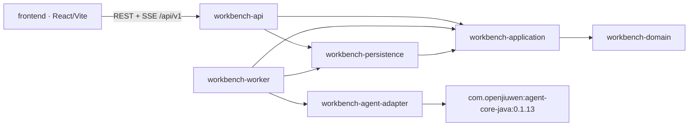
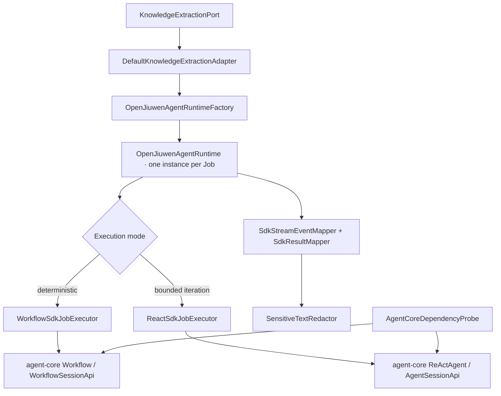

# Source-derived CodeGraph

This graph is intentionally limited to the Maven module boundary and the
`agent-core-java` adapter touchpoints. It is derived from the module POMs and
Java imports; `target`, `dist`, `node_modules`, `output`, product source files,
and generated artifacts are excluded. No runtime CodeGraph dependency is used.

## Adapter touchpoints

Public adapter contracts contain typed records and enums only. SDK `Map` and
`Object` values terminate inside `workbench-agent-adapter`; the API, domain,
application, and persistence modules must not import `com.openjiuwen.*`. The
boundary is enforced by `scripts/validate-code-boundaries.sh` and adapter
contract tests.
